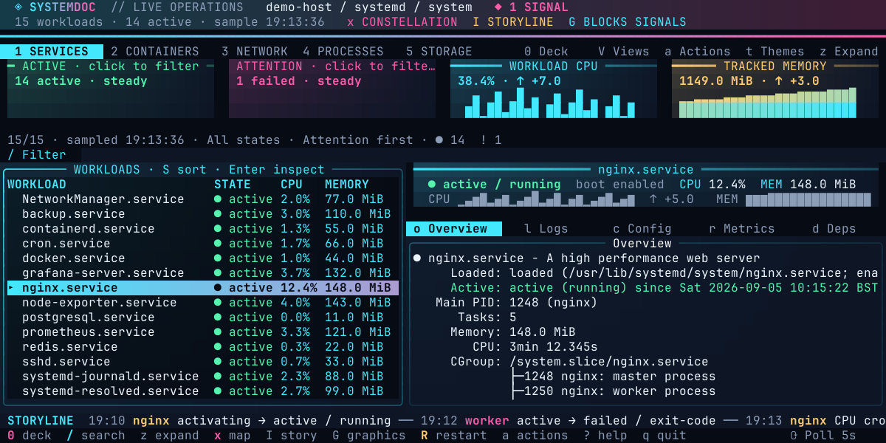
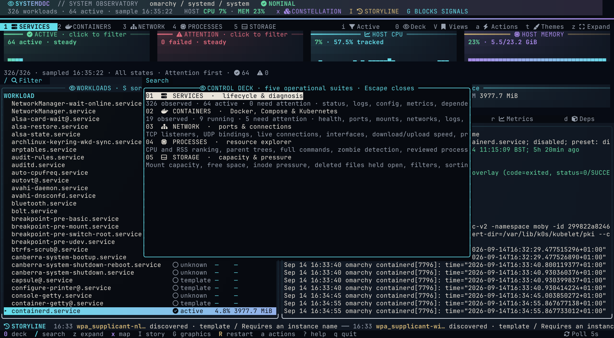
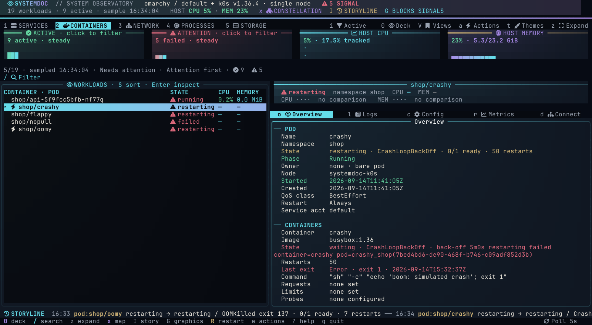
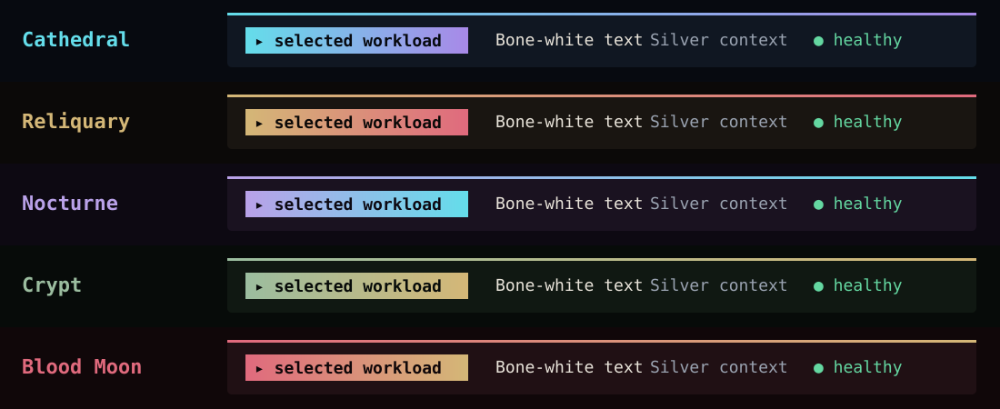

# Systemdoc

[](https://github.com/b404dev/systemdoc/releases/latest)
[](LICENSE)
[](https://github.com/b404dev/systemdoc/actions/workflows/ci.yml)
[](go.mod)
[](docs/installation.md)

**Your Linux and macOS services, Docker containers and single-node Kubernetes pods, in one terminal workspace.**

Find a failing workload, follow its logs, inspect its configuration, and take action without juggling terminals. Systemdoc brings live telemetry, keyboard navigation, and a dark, glowing interface to the native tools you already use.



*Every image in this repository is captured from the real binary against live data with `scripts/capture-panels.sh`.*

*Representative fixture rendered by the actual TUI. Workloads and measurements are illustrative.*

## Install

Linux **x86_64/arm64** and macOS **Apple Silicon (arm64)**. No Go installation or sudo required.

```sh
curl -fsSL https://raw.githubusercontent.com/b404dev/systemdoc/main/install.sh | sh
```

The installer downloads the latest published release, verifies its SHA-256 checksum, and installs `~/.local/bin/systemdoc`. Add that directory to your `PATH` if needed. Run the same command to update.

Prefer to inspect the script first, pin a version, install elsewhere, or build from source? See [installation](docs/installation.md).

## Start here



*`0` opens the Control Deck from any page: five suites, each with its live counts and a one-line description.*

```sh
systemdoc                       # system services: systemd or launchd
systemdoc --user                 # your user services
systemdoc --docker               # Docker containers
systemdoc --filter state:failed  # focus on failures
```

## Five feature suites



*The Containers suite with a k0s stack: Docker containers and Kubernetes pods in one list, the Attention filter on, and a crash-looping pod's overview with its events.*

Press `0` anywhere in the live workspace to open the **Control Deck**. It explains and opens the five numbered suites, so a first-time user can understand the product without memorising commands.

| Suite | What it is for | Rich workflows |
| --- | --- | --- |
| **1 · Services** | Operate and troubleshoot native systemd or launchd workloads. | Live state and accounting, status, streaming/retained log search, source configuration, dependencies/runtime data, timers, activity, reviewed lifecycle actions, drafts and troubleshooting snapshots. |
| **2 · Containers** | Understand individual Docker containers, the Compose projects behind them, and the pods of a single-node Kubernetes stack (k0s, k3s, kind, minikube, microk8s). | Health and resource telemetry, logs, inspect JSON, ports, mounts, networks, limits and labels; Compose discovery, validation, preview, build, pull and reviewed deployment actions; pod overview with events, Services, manifests, Metrics API readings, rollout restart and delete. |
| **3 · Network** | Answer “what owns this port?” and inspect the host’s network surface. | TCP listeners, UDP bindings, active connections, interfaces, live download/upload speed, PID/process/user ownership, precise filters, process drill-down and private snapshot export. |
| **4 · Processes** | Find resource-heavy or unhealthy processes, act on them, and trace where they belong. | CPU/RSS ranking, parent trees, full commands, user/state/PID filters, zombie detection, reviewed process signals, child/parent context, live per-process activity (threads, context switches, I/O, open files, journal), reviewed sysdig tracing of syscalls, files, connections and errors, and direct jumps to associated services or ports. |
| **5 · Storage** | Spot capacity and inode pressure before it becomes an outage. | Mount usage and free-space sorting, inode accounting, shared-pool caveats, deleted files still held open, pressure highlighting, filtering and private evidence export. |

The suites share one visual language, polling interval, keyboard model, theme system, and cross-links. Number keys switch instantly; the selected suite stays visibly highlighted.

- **Understand the workload.** Systemd state, boot enablement, configuration, dependencies, and accounting. Docker identity, image, health, ports, volumes, bind mounts, networks, runtime settings, and labels.
- **Follow what changes.** CPU/memory trends, session activity, streaming logs, a separate log drawer, retained log history, and export.
- **See the system's story.** A visible Storyline rail records observed changes, while System Constellation maps a selected workload to its process and reported dependencies or container connections.
- **Find what owns a port.** A host networking page shows listeners, UDP bindings, active connections, process/PID owners, users, interfaces, live throughput, and filters.
- **Explore processes and storage.** CPU/memory sorting, parent trees, reviewed terminate/kill/suspend/resume signals and port/service shortcuts; mount usage, inode pressure and deleted files still held open. See [host panels](docs/host-panels.md).
- **Act deliberately.** Searchable actions, exact-target lifecycle review, service drafts, and Compose project workflows.
- **Keep your context.** System/user scope, Docker contexts, favourites, filters, and SSH sessions running the full application remotely.
- **Make it yours.** Five Observatory themes combine near-black surfaces, bone-white text, restrained gothic colour and a Nerd Font-first icon vocabulary. Mouse support is optional; the workspace is keyboard navigable.

| Key | Use it for |
| --- | --- |
| `0` | Open the five-suite Control Deck |
| `1` / `2` | Services / containers |
| `3` | Ports and networking |
| `4` | Process Explorer |
| `5` | Disk & Storage |
| `F9` / `K` | Review signals for the selected process (Process Explorer) |
| `/` | Filter the inventory |
| `,` | Change the live polling interval |
| `Enter` / `Tab` | Inspect / move between panes |
| `o` / `l` / `c` / `r` / `d` | Overview / logs / configuration / metrics / dependencies or connections |
| `L` / `z` | Open log drawer / expand focused pane |
| `x` / `I` / `G` | Workload Constellation / incident Storyline / cycle signal graphics |
| `[` / `]` | Give the inspector / inventory more space |
| `a` / `R` | Actions / review restart |
| `V` / `T` / `E` | Saved views / systemd timers / troubleshooting snapshot |
| `t` / `?` / `q` | Themes / help / quit |

[Full keymap and workflows →](docs/usage.md)


*Enter on a process opens Process Activity; `T` from there opens sysdig probes that stream inside the workspace.*

## Built for the dark

Cathedral is the default. Reliquary, Nocturne, Crypt, and Blood Moon change the atmosphere while error, warning, and success colours stay consistent.



Press `t` to preview; Enter saves and Escape restores. JetBrainsMono Nerd Font is recommended and Nerd Font icons are enabled by default; every icon retains a written label and a Unicode/ASCII fallback can be selected in Preferences. A true-color terminal gives the intended gradient treatment. [Theme catalogue →](THEMES.md)

## What you need

| Feature | Runtime tools |
| --- | --- |
| Linux services | systemd and `systemctl`; `journalctl` for logs |
| macOS services · initial support | `launchctl`, `ps`, `plutil`; unified `log` for running jobs |
| Containers | Docker CLI and access to the chosen Docker daemon |
| Compose projects | Docker Compose plugin (`docker compose`) |
| Kubernetes pods | `kubectl` with a reachable context, or the embedded `k0s kubectl`, `k3s kubectl` or `microk8s kubectl`; metrics-server for CPU/memory (optional) |
| Runtime tracing | `sysdig` with `sudo`, or Docker for the official `sysdig/sysdig` image (optional); the BPF probe needs kernel 5.8+, otherwise the `scap` module |
| Remote sessions | OpenSSH client; a remote binary or `--upload` |
| Optional AI help | An installed, separately authenticated Codex or Claude CLI |

An unavailable backend is shown in the UI; it does not disable the other mode, and the Containers suite works with Docker alone, Kubernetes alone, or both. Run Systemdoc as your regular user. Native systemd, journal, Docker, and SSH permissions still apply.

## Documentation

| Guide | Contents |
| --- | --- |
| [Installation](docs/installation.md) | One-line install, updates, pinned versions, source builds, uninstall |
| [User guide](docs/usage.md) | Navigation, logs, Docker overview, actions, Compose, AI assistance |
| [Configuration](docs/configuration.md) | Settings, themes, overrides, layouts, and migration |
| [macOS services](docs/macos.md) | Launchd agents/daemons, Mac builds and current validation limits |
| [Remote hosts](docs/remote.md) | SSH login, key setup, Docker contexts, temporary upload |
| [Troubleshooting](docs/troubleshooting.md) | Backend access, missing metrics, terminal display, installer failures |
| [Contributing](CONTRIBUTING.md) | Local checks, fixtures, and change workflow |
| [Release guide](docs/releasing.md) | GitHub setup, static binaries, checksums, draft releases |
| [Security](SECURITY.md) | Permissions, configuration data, reporting vulnerabilities |

Try the optional [container playground](playground/README.md) for a small, real Compose project and a single-node k0s stack with sample pods.

## Project status

Systemdoc v0.1.0 is the first public release. macOS support is implemented and cross-built; live Mac verification remains a release requirement. Implemented features are described in the user guide; known limits and manual test gaps are recorded in [troubleshooting](docs/troubleshooting.md) and [the release guide](docs/releasing.md). Inventory uses CLI polling, and activity history is session-local. Resource totals describe reporting workloads, not whole-host usage.

[Architecture](SPEC.md) · [Visual system](VISUAL-DESIGN.md) · [Changelog](CHANGELOG.md)

## License

Systemdoc is released under the [MIT License](LICENSE).
