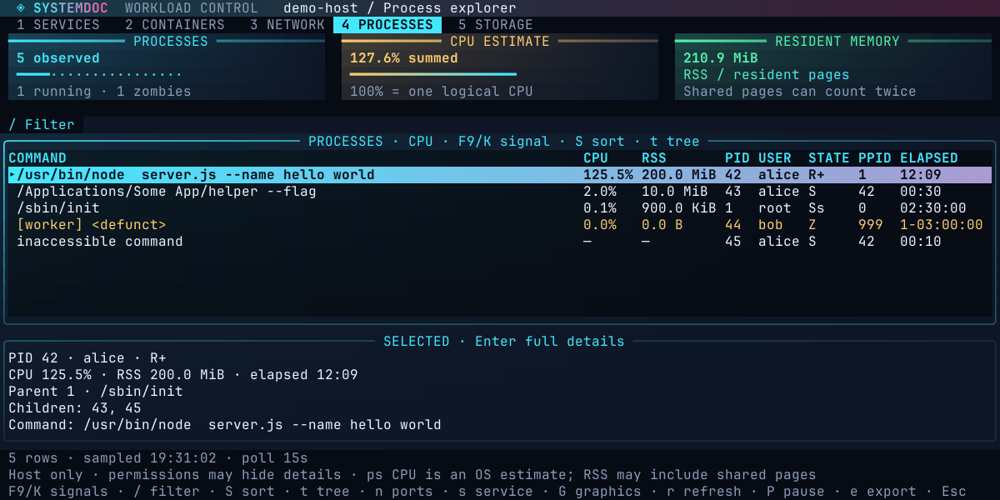
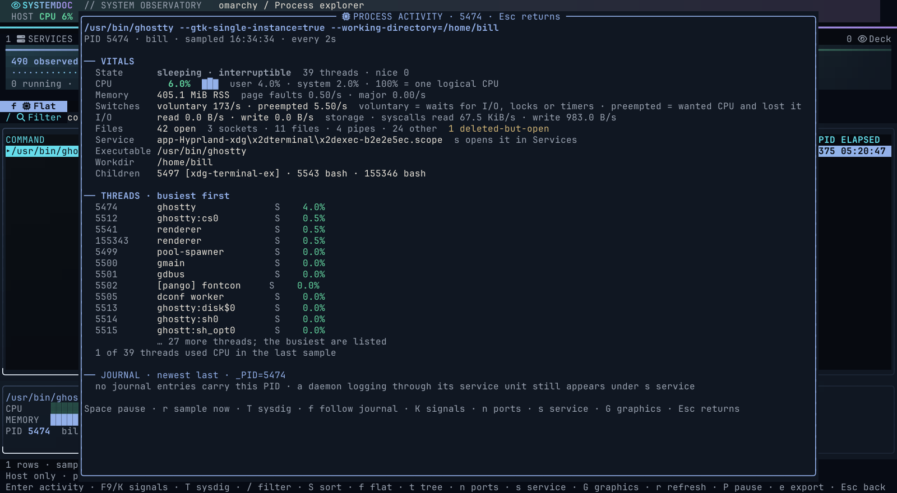
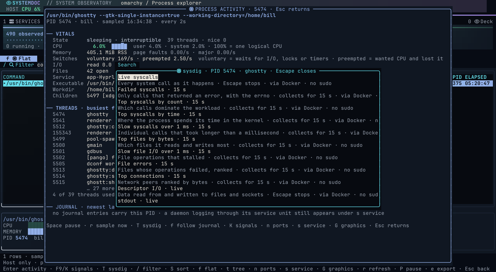
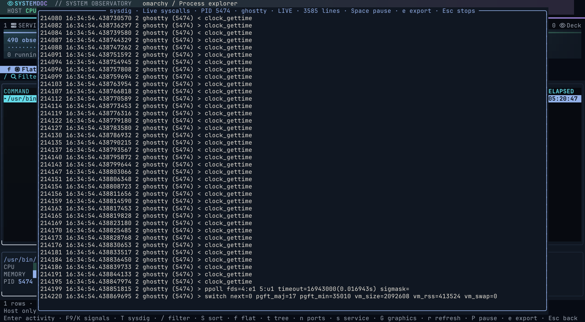
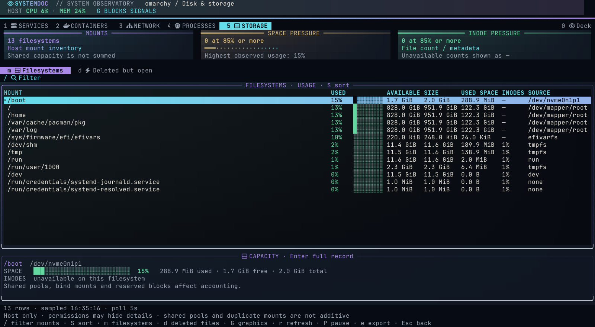

# Process Explorer and Disk & Storage

Press **4** for Process Explorer or **5** for Disk & Storage. Both are also available in the top navigation and Actions menu. They inspect the host running Systemdoc, independently of the Docker context, and share the dashboard header, gradient cards, selection styling and keyboard navigation.

Each panel carries its own view rail beneath the cards, naming the two views that suite actually has: **Flat** and **Tree** for processes, **Filesystems** and **Deleted but open** for storage. The rail is clickable and mirrors the keyboard. Where the terminal is at least 100 columns wide the header also carries the host CPU and memory readout described in [the dashboard guide](usage.md).

Each suite is lit by its own signature hue, taken from the theme's decorative accent-to-glow range, so Networking, Process Explorer and Disk & Storage are distinguishable at a glance. Error, warning and success keep one meaning everywhere and are never used for panel identity. Each panel also names its selection band for what it shows - **Process vitals**, **Capacity**, **Open handle** - rather than a generic "selected" label.

At 100 columns or wider the CPU and usage columns carry an inline meter beside the figure, coloured by severity: green below 70%, amber from 70%, red from 85%. Meters follow the shared `G` block/braille/ASCII setting, which changes presentation only and never the measurement.

*Captured from the real binary: the host's processes ranked by CPU, with Process Vitals for the selected row. `F9` or `K` opens the signal palette, Enter opens live activity.*

## Process Explorer

Process Explorer takes a full host process snapshot with `ps`. To prevent short polling settings from creating bursty CPU load, this view refreshes no faster than every 15 seconds (a slower configured interval is respected). The temporary `ps` sampler itself is excluded from the displayed snapshot.

Press `G` to cycle the shared block, braille and ASCII signal style used by Process Explorer and Storage pressure meters. The choice is saved for every suite.

The two resource cards plot the machine's own recent CPU and memory utilisation on a fixed 0-100% scale, beside the summed `ps` figures; the CPU card also carries the one-minute load average, and the Processes card adds a `stall` reading from the kernel's pressure accounting when tasks have been waiting on CPU, memory or I/O. The chart is a real series sampled independently of the process snapshot; the summed figures are a single snapshot, and the card names both so they are not read as one measurement. From 100 columns the CPU card's title names the machine's logical CPU count and current clock (`HOST CPU · 8 CPUs · 3.2 GHz`), and beside the trend it draws one bar per logical CPU at that CPU's own busy share over the same two-second interval, coloured by the shared severity ramp, with the clock beneath. Cores whose clocks differ by more than about 5% show the spread (`800 MHz–4.2 GHz`) rather than a single figure. When there are more CPUs than the card can fit, the strip becomes a count of CPUs above 70%. The selection band below the table shows the selected process's CPU and resident memory as gauges, with its state, elapsed time and parent; the CPU gauge says how many logical CPUs the machine has and what the process's share amounts to as a fraction of the whole machine.

The process table shows full command lines, CPU estimate, resident memory (RSS), PID, the CPU the process was last scheduled on (`ON`, Linux only), user, state, parent PID and elapsed time. Narrow terminals keep the primary columns.

**`c` opens CPU Cores**, the per-CPU view. Every logical CPU has a row: the physical core and socket it sits on, a busy meter and percentage coloured by the shared severity ramp, the split of that interval into user, system, iowait and steal time (iowait from 10% and steal from 5% are highlighted, since the first explains a machine that is idle but slow and the second a virtual machine whose host is oversubscribed), the clock that CPU is running at, its own recent trend, and the busiest process last scheduled on it with its PID and share. A CPU whose processes all read 0% is reported as idle with a count of the processes last placed there rather than naming an arbitrary sleeper. Above the table the view repeats the whole-machine share, the three load averages, any stall reading and the host trend, and names the inventory: logical CPUs, cores and threads, sockets, model, current clock, advertised range and where the clock was read from. `S` switches between busiest-first and CPU-number order; `G` changes the glyphs; Esc returns. The view reads the samples the host metrics loop already takes every two seconds and adds no polling. It also opens from the dashboard with `C` or by clicking the HOST CPU card, where the process column is left out because the dashboard holds no process snapshot.

**Enter digs into the selected process.** Process Activity samples that one PID from `/proc` every two seconds, independently of the slower table interval, and shows what the daemon is actually doing: its state in words (running, sleeping, waiting on disk or device, zombie), CPU split into user and system time with a trend and the share of the whole machine that represents, a `CPUs` line with the logical CPU the process last ran on, that CPU's clock and busy share, and its allowed CPU set (a process confined by `taskset` or a cgroup cpuset to fewer CPUs than the machine has is flagged), a `Host` line with the machine's CPU inventory (logical CPUs, cores and threads, sockets, model, current clock, advertised range and where the clock was read from), RSS and swap, page-fault rates, how often it yields (voluntary switches, meaning waits for I/O, locks or timers) versus how often it is preempted, storage and syscall I/O rates, open descriptors broken into sockets, files, pipes and other, deleted-but-open files, the owning service unit, executable, working directory and children. A thread table lists every thread busiest first with its own CPU share, state and the CPU it last ran on, so a single hot thread, a thread stuck in `D` state, or a set of threads all queuing on one CPU stands out. The newest journal lines carrying the PID follow. Rates need two samples, so the first frame says so rather than showing zero; when the process exits or the PID is reused the view says which and stops sampling.

Another user's process exposes its threads, switches, memory, unit and journal but not its I/O counters or descriptors; those lines say so instead of reading zero. Inside the view, Space pauses, `r` samples now, `f` follows the process's journal live in a panel, `K` opens the signal palette, `n` jumps to its ports, `s` to its service, `T` opens sysdig tracing and `G` cycles the graphics. macOS has no `/proc`, so Enter shows the full record there.

*Process Activity for a terminal emulator owned by the current user, so every counter is readable: 39 threads with the renderer and I/O threads busiest, 42 descriptors including one deleted-but-open file, and the owning scope.*

### Runtime tracing with sysdig

`T` on a process, or **Trace with sysdig** in the Containers Actions menu, opens a palette of [sysdig](https://github.com/draios/sysdig) probes for that exact target: a process (`proc.pid`), the process and its children (`proc.apid`), a container (`container.id`) or a pod (`k8s.pod.name` and `k8s.ns.name`, which relies on the runtime labelling containers with their pod). sysdig sees what the binary actually does: every system call with its arguments and result, attributed to files, sockets and containers.

| Probe | What it answers |
| --- | --- |
| Live syscalls · Descriptor I/O · stdout · stderr | Streams in the terminal until Ctrl-C |
| Failed syscalls · 15 s | Which calls return errors, and which errno |
| Top syscalls by count / by time · 15 s | What dominates the workload and where kernel time goes |
| Slow syscalls · Slow file I/O over 1 ms · 15 s | Individual stalls |
| Top files by bytes · File errors · 15 s | What it reads and writes, and what fails |
| Top connections · 15 s | Network peers ranked by bytes |
| Capture to file · 30 s | A compressed `.scap.gz` for offline `sudo sysdig -r` analysis |

*The probe palette for one PID. On this host the installed sysdig did not load, so every entry runs through the official container image without sudo.*

*Live syscalls follow in a panel; Space pauses, `e` exports and Escape stops the capture cleanly.*

Every probe is reviewed with the exact command before it runs, and nothing leaves the workspace. Systemdoc runs the installed sysdig through sudo when it loads; when sysdig is missing, or its libraries fail to load, and Docker is usable, it runs the official `sysdig/sysdig` image instead as a privileged container with the host's `/proc`, `/dev` and `/etc` and the BPF probe (no kernel module), pulling it once under a cancellable overlay. The container route needs no sudo (Docker group membership is already root-equivalent) and the review dialog shows the full `docker run …` command. `SYSTEMDOC_SYSDIG=native|container` forces the choice. sysdig needs root and a capture driver: on kernels 5.8 and newer Systemdoc uses the CO-RE BPF probe (`--modern-bpf`, no kernel module); older kernels use the `scap` module, and `SYSTEMDOC_SYSDIG_ENGINE=kmod|bpf|modern-bpf` overrides the choice. When sudo has no cached authorization, a masked field in the workspace asks for your password once and hands it to `sudo -S -v` on standard input; it is discarded immediately and never stored. Live probes stream into a panel: the last 500 lines follow as they arrive, scrolling up or Space pauses, `g` resumes following, `e` exports the retained buffer through the review flow, and Escape stops sysdig with the same interrupt Ctrl-C would send, so the capture ends cleanly and prints its summary. Timed probes collect in the background under a cancellable overlay while the dashboard stays live, then show the summary with `e` to export it. Tracing adds overhead to the traced workload while it runs; captures include data buffers and can contain secrets, and the capture file is created by root in the current directory. When sysdig is missing, the message names the package command for your distribution.

- `S` cycles CPU, memory and PID sorting.
- `c` opens the CPU Cores view described above.
- `f` shows the flat list and `t` the parent-child tree; `t` still toggles between them. Filtering keeps matching rows; a process whose parent is filtered out becomes a displayed root.
- `/` filters commands, users and states. Combine fields such as `pid:123`, `ppid:1`, `user:alice`, `state:Z` and `command:node`.
- `F9`, `K` or Delete opens reviewed process actions: graceful terminate (`SIGTERM`), interrupt (`SIGINT`), hangup (`SIGHUP`), suspend (`SIGSTOP`), resume (`SIGCONT`) and force kill (`SIGKILL`). Choose an action, then press `y` on the review screen (or Tab to **Run**). The review shows the exact PID, user, state and command. PID 1 and Systemdoc itself are protected. Immediately before signalling, Systemdoc re-reads the command and refuses the action if the PID disappeared or changed identity. Signals use your existing OS permissions and never invoke `sudo`; a service manager may restart a supervised process.
- `n` opens Networking filtered to the selected PID, including listeners and connections. From Networking, `p` opens Process Explorer for the selected socket owner.
- `s` opens an associated service in the current inventory. Linux uses the process's service cgroup; macOS matches PIDs in the current launchd inventory. Standalone processes, inaccessible associations and services outside the current system/user scope are reported explicitly. The service inspector provides its usual logs and configuration tabs.

The collector uses `ps` on Linux and Apple Silicon macOS. On Linux, CPU is the share of one logical CPU the process used between the last two snapshots, read from `/proc/<pid>/stat`; the first snapshot shows the `ps` lifetime average until a second sample exists. On macOS CPU stays the `ps` estimate, a lifetime average rather than a current rate. Either can exceed 100% for multiple cores.

The CPU inventory is read once at start. On Linux the logical count is the set of `cpuN` lines in `/proc/stat`, cores and sockets come from `/sys/devices/system/cpu/cpuN/topology` with `/proc/cpuinfo` as the fallback, and the model string is `/proc/cpuinfo`'s. Clocks are sampled every two seconds with the host utilisation: `scaling_cur_freq` from cpufreq when the kernel exposes it, which is what the governor is asking of each core right now, otherwise the `cpu MHz` lines of `/proc/cpuinfo`, which the panels label as nominal because inside most virtual machines that figure never moves. The advertised range is cpufreq's `cpuinfo_min_freq` and `cpuinfo_max_freq`. Per-CPU busy shares compare the `cpuN` counters between two samples exactly as the aggregate figure does, and a CPU whose counters went backwards or that went offline between samples is drawn as a gap. The `ON` column and the busiest-process column in CPU Cores read field 39 of `/proc/<pid>/stat` during the same pass that computes the interval rate; it is where the scheduler last placed the process, not an affinity, which Process Activity shows separately as the allowed set. On macOS the counts and brand string come from `sysctl` (`hw.logicalcpu`, `hw.physicalcpu`, `hw.packages`, `machdep.cpu.brand_string`); Apple Silicon publishes no clock through `sysctl`, so the frequency stays unknown there rather than guessed, and CPU Cores shows counts and clocks without per-CPU utilisation. A row `ps`, `df`, `ss` or `launchctl` prints in a shape Systemdoc does not recognise is skipped and counted in the status line instead of discarding the snapshot. Summed RSS can count shared memory more than once. Missing metrics show a dash. Parent relationships and PID ownership can change between the process sample and subsequent inspection.

## Disk & Storage

The selection band shows the selected filesystem's space and inode usage as full-width gauges with used, free and total figures. Filesystems that do not report inode counts say so rather than drawing an empty gauge.

The filesystem table shows mount paths, percentage used, available space, capacity, used space, inode usage and the source device. `S` cycles highest usage, least free space and mount-path order. Mounts at 85% space or inode usage are highlighted. `/` searches mount paths and source devices, including paths with spaces. Enter shows all fields.

`d` switches to **Deleted but open** files and `m` returns to filesystems. This runs `lsof +L1` when that view is opened and refreshes it while visible. It lists regular files that have been unlinked but are still held open, with path, logical size, owner, PID, UID and file descriptor. `S` sorts by size, PID or path. The two views retain separate filters and sample times.

On Linux, filesystem capacity is read directly: the mount table from `/proc/self/mountinfo` (pseudo filesystems such as proc, sysfs and cgroup are skipped, shadowed mount points keep the visible mount) and usage from `statfs` per mount, so one unreadable FUSE mount or one stale network mount can no longer blank the whole view. A mount that does not answer within two seconds is listed in the status line as unreachable and omitted. macOS keeps `df -Pki`. APFS/Btrfs shared pools and duplicate/bind mounts mean filesystem capacities cannot safely be added together, so the cards report mount count and pressure instead of a misleading host total. Unsupported inode counts show a dash. The deleted-file size card deduplicates known device/inode pairs; missing identities count per handle, and unknown sizes are excluded. Logical file size is not a promise of reclaimable disk space.

## Refresh and reports

Storage refreshes at the configured interval; Process Explorer and the Deleted but open view (an `lsof` scan of every open descriptor) use the configured interval with a 15-second minimum. `r` always requests an immediate refresh, `P` pauses automatic refresh, Tab moves between filter/table/details, and Escape returns. Failed refreshes preserve the previous sample and show the error. Missing `ps`, `df` or `lsof`, permissions and truncated output are reported. Commands have a timeout and bounded output. Process signals are the only host mutation here; Systemdoc does not delete files, unmount storage or elevate privileges.

`e` opens the existing snapshot review/export flow for the filtered rows. Process commands and file paths can contain private information; inspect the report before sharing it.

macOS parsing follows Apple's [ps field definitions](https://github.com/apple-oss-distributions/adv_cmds/blob/main/ps/keyword.c) and [df output implementation](https://github.com/apple-oss-distributions/file_cmds/blob/main/df/df.c). Deleted files use the upstream [lsof field format](https://github.com/lsof-org/lsof/blob/master/Lsof.8).
