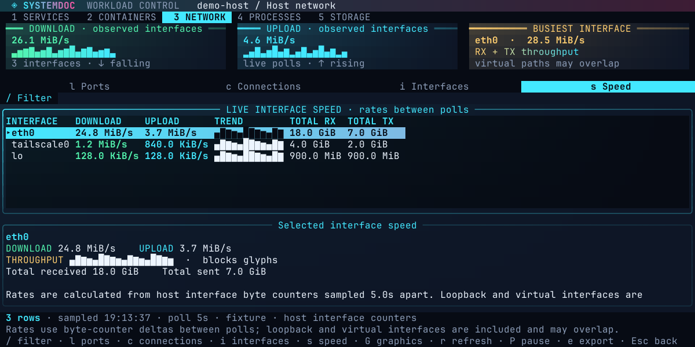

# Ports and networking



*Illustrative counter samples rendered by the actual TUI; rates and interface names are fixtures.*

Press `3`, or choose **Actions → Ports and networking**, to inspect the host running Systemdoc. The page keeps four views:

- **Ports** lists TCP listeners and bound UDP sockets, ordered by local port.
- **Connections** lists all observed TCP and UDP sockets, including established and closing connections.
- **Interfaces** lists host interfaces, addresses, flags, MTU and hardware address.
- **Speed** shows live per-interface download and upload throughput plus cumulative byte counters.

Press `l`, `c`, `i` or `s` to open **Ports**, **Connections**, **Interfaces** or **Speed** directly, or click the view rail; `/` focuses the filter. The first sample establishes a counter baseline; rates appear after the next automatic poll, or after pressing `r`. Download/upload values are byte-counter deltas divided by the real time between samples. Each interface, the download/upload cards and the selected-interface lens retain a bounded throughput trail. Press `G` to cycle block, braille and ASCII signal graphics. Linux reads `/proc/net/dev`; macOS reads `netstat -ibn`. The Speed view samples only these counters—it does not enumerate sockets or scan the process list. These are host-interface throughput rates, not negotiated Wi-Fi/Ethernet link capacity. Loopback, bridges, VPNs and other virtual interfaces remain visible, so summing every row can count the same traffic more than once. A reset or rollover is shown as a fresh baseline instead of an invented negative rate.

Select a socket and press Enter to inspect its process command, PID, user, file descriptor, inode, address family and service cgroup. Process details are fetched separately, so a PID may have exited or been reused between the socket sample and inspection. A socket without an owner remains visible; permissions can hide owners.

Press `p` to open [Process Explorer](host-panels.md) filtered to the selected socket's PID. Press `4` or `5` to switch to Process Explorer or Disk & Storage.

Filters are field-aware and can be combined:

```text
port:3000
localport:8080 process:node
proto:tcp state:listen
pid:1234
user:postgres
remoteport:443
```

Plain words search the protocol, addresses, process, user, state and service metadata. IPv4, IPv6, wildcard and interface-scoped addresses stay in their numeric form. A bind address describes where a process listens; it does not prove that a firewall permits external traffic.

The selection band leads with an **exposure** chip read from the bind address alone: `LOOPBACK` for an address bound only to this host, `ADDRESS` for a single interface address, `HOST-WIDE` for a wildcard bind, and `FLOW` for an established connection. The chip summarises the binding and nothing more - a bind address is not a firewall rule, and the band says so.

Linux uses `ss` for the host network namespace and resolves the UIDs it reports through the operating-system user database; periodic Network polling does not launch `ps`. macOS uses structured `lsof` output. A partial `lsof` result is retained and labelled when the command exits with status 1; genuine command failures leave the previous snapshot in place and show the error. Only the active Network view is collected at the normal refresh interval, selection is preserved when possible, and polling can be paused with `P`. Opening the one-off process-details dialog may still query the selected PID with `ps`.

Press `e` to review and save the current filtered view as a private troubleshooting report. The report identifies the host, source command family, sample time, view, filters and visible rows. It does not query a Docker VM, remote Docker context, or container network namespace; open the relevant host or container environment separately. Network snapshots may contain internal addresses, usernames, process names and service paths, so review before sharing.

The socket views need `ss` on Linux or `lsof` on macOS; macOS speed sampling additionally uses `netstat`. Missing tools, denied socket access, malformed output and output over 4 MiB are reported visibly instead of being converted into an empty result. UDP rows are bindings or datagrams, not TCP listeners. Multiple processes can share a socket.
