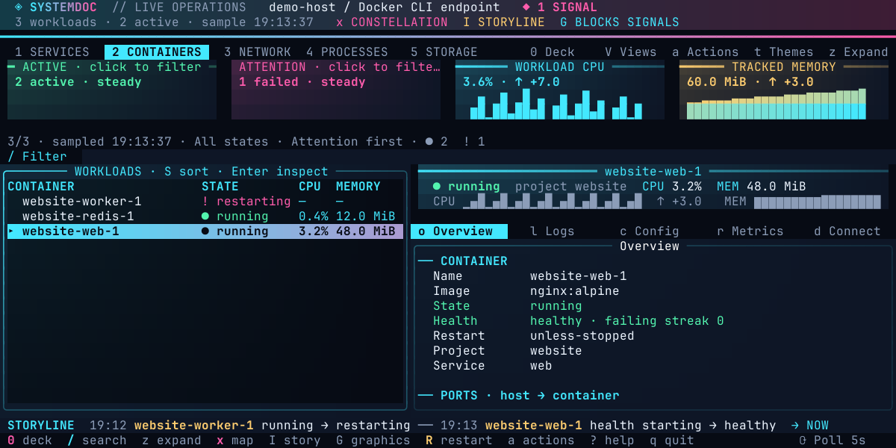
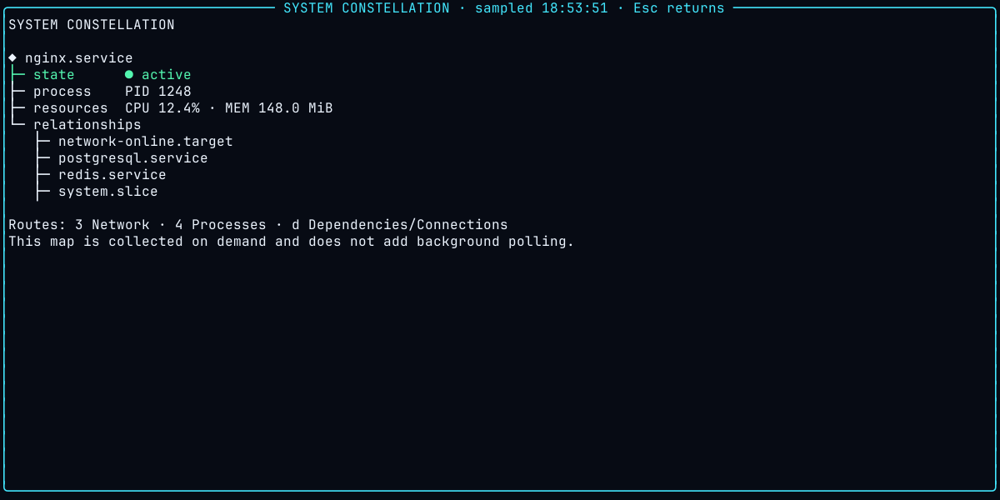

# User guide

[Documentation index](README.md) · [Install](installation.md)



*Illustrative container fixture rendered by the actual TUI; scroll or expand for all fields.*

## The five feature suites

Systemdoc is organised around five live operational suites. Press `0` from any suite to open the searchable **Control Deck**, which describes all five and routes directly to one. Press `1`–`5` for immediate switching.

| Suite | Purpose | Use it when you need to… |
| --- | --- | --- |
| **1 · Services** | Native service control and diagnosis | Find failed systemd/launchd jobs, inspect status/configuration/dependencies, follow or search logs, review timers and run exact-target lifecycle actions. |
| **2 · Containers** | Docker runtime and Compose workflows | Read health/resources, inspect ports/mounts/networks/limits, follow logs, examine raw JSON, or validate and operate a Compose project. |
| **3 · Network** | Host ports, flows, interfaces and speed | Identify a listener or connection owner, filter by port/PID/process/protocol/state, inspect interfaces, watch download/upload throughput, or jump to process detail. |
| **4 · Processes** | Host resource, ownership and signal explorer | Rank CPU/RSS, inspect parent/child trees and full commands, find zombies, review a process signal, or pivot from a PID to its service and ports. |
| **5 · Storage** | Filesystem capacity and reclaim investigation | Find full mounts or inode pressure, sort/filter storage, and identify deleted files that are still held open. |

Each suite uses the same polling preference, numbered navigation rail, Deep theme, filter conventions, focus styling and reviewed export model. Observations stay tied to their actual collector; the application does not pretend separately sampled host data is one atomic snapshot.

## Services and containers

Services use systemd on Linux and launchd on macOS. See [macOS services](macos.md) for GUI/system scopes, supported actions, PID-scoped logs and current limits. The systemd-specific workflows below apply to Linux.

**Systemd** combines loaded services and installed unit files, separates enablement from runtime state, and shows available CPU/memory accounting. The inspector provides status, streaming journal, source configuration, sampled resources, and dependencies. Runtime aliases such as `dbus.service` resolve to their canonical service; searching an alias finds that service without duplicating its active count. Template files (`name@.service`) are labelled separately and require a named instance for runtime inspection. An installed file absent from the runtime snapshot is labelled `unknown`, not guessed inactive or unloaded. The compact selected-service band shows runtime state/substate, boot enablement and resources; Overview retains load state and the full description. Toggle system/user scope with `u`. Press `i` or click **Active only** to hide inactive services; the systemd choice persists between sessions. `--active-only` enables the filter at launch, including over SSH.

**Docker** shows observed containers with state and available CPU/memory statistics. The selected-workload card and expanded table expose health/status, image, and Compose project membership. The Overview tab shows container name and ID, image, state and health, restart policy, Compose membership, host/container ports, volumes and bind mounts, attached networks and addresses, runtime options, limits, and labels. Published ports and exposed-only ports are distinguished; configured bindings without a live mapping are labeled. Mounts include access mode, source, and destination. Environment values remain in the full inspect JSON (`c`), rather than the overview. `d` opens Connections with ports, mounts, networks, and labels; `l` streams logs and `r` reads live resource statistics. Structured Docker views wrap long paths and values; `z` expands them. Press `p` for Compose projects, including registered projects whose containers are down.

Docker uses the selected CLI endpoint. At startup, the current Docker context is pinned when no explicit `DOCKER_HOST` or `DOCKER_CONTEXT` is supplied. Override it explicitly:

```sh
systemdoc --docker --docker-context production
```

Unavailable backends produce a visible error without disabling the other mode. Existing systemd, journal, Docker, and SSH permissions apply; Systemdoc does not change socket permissions or group membership.

## Live workspace

While the same workload remains selected, background updates preserve the focused pane and your current inspector scroll position, including scrolling performed while a refresh is still loading. Live logs retain their separate pause/follow controls.
Four Pulse cards show active workloads, those needing attention, summed workload CPU, and tracked memory. After a second sample, all four become real history charts with the latest direction shown beside the value. Click Active or Attention to filter the list; click again to clear. `A` cycles the same state filters from the keyboard. The always-visible **i Active only** button directly toggles active/running workloads. Each mode keeps its own filter when you switch. Counts describe the current backend inventory; resource totals include only workloads reporting counters, **not whole-host usage**. CPU uses one logical CPU as 100% and may exceed it. Missing values stay `—`. Charts retain bounded inventory samples and use an automatic scale; they never create an additional collector.

The list uses a dark continuous surface, semantic state colours, and a gradient selection highlight with a pointer. `S` sorts by name, attention, CPU, or memory without changing the selected workload. `›` marks a state change observed within the previous 15 seconds. The selected-workload Focus Lens includes its own bounded CPU and memory trails. The one-line **Storyline** rail shows the latest state transitions across the current suite; click it or press `I` for the complete bounded session view, while `v` keeps the selected workload's activity view. Polling may miss brief transitions.

Press `x` for **System Constellation**, an on-demand relationship map for the selected workload. Services show state, process, resources and reported systemd dependencies; containers show identity, project, image, ports, mounts and networks from the existing Connections collector. The map does not add background polling. Press `G` to cycle **blocks**, **braille**, and **ASCII** signal graphics; the choice is saved and applies to dashboards, Network Speed, Process Explorer, Storage and resource history. The footer shows the active polling interval; click it or press `,` from any live page to set 2–300 seconds. A small muted spinner appears only while the current backend refreshes.



*Illustrative relationship fixture rendered by the actual TUI.*

The inspector keeps the selected workload's identity, state and resources in a compact band above clickable tabs; Overview carries the longer description and backend detail. Press `L` to open a separate live log drawer and keep logs visible while reading configuration or metrics. The drawer follows selection, cancels the old stream when the target changes, and retains at most 1 MiB. Live panes render the newest 500 matching lines to keep redraws fast; `h` opens the full retained buffer as a frozen history view. `e` exports the retained buffer of the focused log pane, rather than just its live window. Tab cycles through the list, inspector and open drawer; Space pauses the focused log view, `g` follows again, and `L` closes the drawer.

Press `z` to expand the focused pane. An expanded workload list reveals boot/substate/description columns for systemd, or project/health/image for Docker. Escape restores the dashboard. At 110 columns or wider, automatic layout places list and inspector side by side. `[` gives more room to the inspector and `]` gives more room to inventory, in five-percent steps from 30–70%. Tall, narrower terminals stack them; smaller terminals show the focused pane. Telemetry cards collapse when space is tight. Actions, sorting, themes and preferences open in bounded overlays.

## Keyboard controls
| Key | Action |
| --- | --- |
| 0 | Open the Control Deck and descriptions of all five suites |
| 1 / 2 | Systemd / Docker |
| 3 | Ports and networking |
| 4 | [Process Explorer](host-panels.md) |
| 5 | [Disk & Storage](host-panels.md) |
| F9 / K | Open reviewed signal actions for the selected process in Process Explorer |
| / | Inventory filter |
| , | Change live polling interval |
| Arrows or j/k | Navigate |
| Enter / Tab | Inspect / cycle panes, including the open log drawer |
| i | Toggle active-only; systemd choice is saved |
| A / S | Cycle state filter / choose sorting |
| h | Full retained log history for the focused log pane |
| z / Escape | Expand focused pane / restore dashboard |
| [ / ] | Give the inspector / inventory more space |
| L | Toggle independent live log drawer |
| x / I | Open selected workload Constellation / suite-wide incident Storyline |
| G | Cycle block, braille and ASCII signal graphics |
| o / l / c / r / d | Overview / logs / config / resources / dependencies (Docker: connections) |
| R | Review restart of selected workload |
| a | Searchable actions; type to filter, Down enters results |
| : | Supported native-style commands with completion and session history |
| p | Compose projects |
| t | Live theme preview; Enter saves, Escape restores |
| f / F | Toggle favourite / show favourites only |
| P | Pause/resume inventory refresh |
| Space / g | Pause/resume log follow |
| s | Network speed view; elsewhere, search/filter the focused live logs |
| V | Save, open, replace or delete workspace views |
| T | Browse systemd timers in system/user scope |
| E | Collect, review and export a troubleshooting snapshot |
| e | Export inspector to a new private file |
| v | Observed workload activity in this session |
| H | Operation history; Ctrl-X cancels active local process |
| u | Toggle systemd system/user scope |
| ? / q | Help / quit |

Printable shortcuts do not intercept text fields. Escape closes overlays or returns focus. Arrow-up/PageUp in the log inspector pauses follow. Live logs retain at most the latest 1 MiB; severity colours are reading aids based on message text, not authoritative journal priority classification.

Inventory filters accept plain terms and fields:

```text
state:failed
state:active
project:website
name:worker enabled:true
boot:masked
```

## Saved views

Press **V**, click **Views**, or use Actions → Saved views to save the current workspace with a name. A view remembers backend mode, systemd scope, inventory text and state filters, sorting, favourites-only, layout, pane split, inspector tab and log-drawer visibility. Choose an existing view to open, replace with the current workspace, or delete it. Names must be unique. Views are saved in settings; saving a view does not save log buffers or workload data.

Docker views record the current endpoint and refuse to open against a different endpoint. Launch Systemdoc with the matching Docker context to use them. Views do not switch remote hosts. Opening a systemd view restores its recorded system/user scope and refreshes that inventory.

## Rich log search

Press **s** from the log inspector or focused log drawer. **Search history** searches a frozen copy of the retained buffer, independent of any live literal filter. It supports case-insensitive literal text or Go regular expressions, inclusive Since/Until bounds, and 0–20 surrounding lines. Leave the query blank to match all lines within the time bounds.

Use RFC3339 timestamps (for example `2026-09-06T10:00:00Z`) or local `YYYY-MM-DD HH:MM:SS`. A date alone means local midnight. With time bounds, matching lines must start with a supported timestamp; surrounding context can include untimestamped lines or extend outside the bounds. Overlapping context is merged. Results preserve original retained-buffer line numbers and mark matches with `›`. Press **n** / **N** for next/previous match, or Escape to return. Search does not fetch older backend logs; retention is still at most 1 MiB per live pane.

**Live literal filter** applies the query to the streaming inspector (empty clears it). Regex/time fields must be clear for that action; context applies only to history search. Drawer searching uses Search history.

## Systemd timers

Press **T**, or Actions → Systemd timers, from either backend. The read-only browser lists loaded timers, including inactive loaded timers, sorted by next trigger. It shows exact next and last trigger times in the local timezone, the activated unit, and the relative time until the next trigger. Missing/infinite trigger times appear as `—` / unscheduled.

Press **u** to switch the browser's system/user scope, **r** to refresh its snapshot, and Enter for timer status/configuration or the activated unit's status/recent journal. Escape returns. The browser scope is independent of the main workspace. Last trigger time is not evidence that the job succeeded. A past next trigger is labelled “due / awaiting update”. Timer files that are not loaded are not included. The installed `systemctl` must support JSON output for `list-timers`; unsupported output is reported visibly.

## Troubleshooting snapshots

Press **E**, or Actions → Troubleshooting snapshot, with a workload selected. Collection is tied to that exact workload and scope. It fetches fresh overview/status and resources, and includes matching observed session activity. Recent logs (latest 150 requested) are selected by default; configuration/full Docker inspect JSON is opt-in. Each command is capped at 1 MiB and has an eight-second timeout. Escape cancels collection. Failed sections are identified in the report, and sections are timestamped individually because collection is sequential.

Review and edit the report before saving. Tab moves from the editor to filename and save controls; Shift-Tab moves back. The report is written with owner-only permissions and never replaces an existing path. Nothing is sent to an external service. Native service status can include journal excerpts even when the separate recent-log section is omitted; overview, labels, logs and configuration may contain sensitive values. No automatic redaction is applied.

## Management workflows
Press **Shift+R**, or choose restart from the visible **Actions** menu, to restart the selected service or container. Review the exact target and command, then choose Run. Systemd uses the current system/user scope; remote sessions run the command on the remote host. Lowercase `r` still opens resource metrics.

Open Actions for service start/stop/restart/reload, enable/disable, mask/unmask, and reset-failed. Docker actions include start/stop/restart, pause/unpause, and removal. Every lifecycle action currently presents an exact-target review. Operation history distinguishes command completion from actual workload health and retains bounded output.

For terminal authorization on system services, choose **System service authorization**. Native editing and shell workflows suspend the interface and restore it when the tool exits. A container shell defaults to `/bin/sh`.

**New service draft** opens an editable template with user/system scope. Validation uses `systemd-analyze verify`; installation never replaces an existing unit. User installation uses an atomic new-file operation. System installation uses terminal `sudo`, a private staging file, and a non-clobbering copy followed by destination verification. Installation reloads the chosen manager but does not enable/start the service. Existing units can be changed through native `systemctl edit`.

**New Compose project** opens a source editor. It validates against the selected directory, saves a new owner-readable source file, and registers the project. Deployment is a separate action. Registration supports a main file, an override, an environment file, profiles, and a working directory. The settings file can describe additional ordered files/environment files. Registered projects are bound to their Docker endpoint.

Compose actions include status, logs, configuration preview, validation, up/start/stop/restart/down, pull, and build. `down` does not include volume deletion. Configuration preview disables interpolation and environment-file resolution; review still matters because source files can contain literal secrets. Discovered file paths are hints, and source-dependent operations fail visibly if those paths are unavailable.

`systemctl status` exit code 3 is handled as ordinary inactive status. Exit code 4 produces a clear “unit not found” message with the selected system/user scope, following [systemd's status-code meanings](https://github.com/systemd/systemd/blob/main/man/systemctl.xml). Templates offer configuration inspection and instance guidance instead of issuing runtime queries against a bare template name.

## Familiar commands
The command bar deliberately supports a defined subset, rather than silently ignoring unsupported flags:

```text
systemctl status nginx.service
systemctl --user restart worker.service
systemctl cat nginx.service
journalctl -u nginx.service -f
docker logs --follow website-web-1
docker inspect website-web-1
docker restart website-web-1
```

Read commands open the corresponding inspector. Lifecycle commands use the same review flow as Actions. Pipelines, shell expansions, wildcard mutations, and arbitrary shell commands are rejected. Use the project menu for Compose operations.

## AI assistance
Actions → **AI troubleshooting** offers installed Codex or Claude CLIs. Review/edit the exact text before sending; status/name are included, while logs/configuration are pasted explicitly. There is no automatic credential redaction or hidden bulk context collection. AI can explain failures or draft a service from your requirements. Ctrl-D opens a response as an editable service draft; validation and installation remain separate.

The adapter starts in a temporary directory, disables execution tools through provider options, and requests an ephemeral/non-persistent session. Unsupported provider flags fail rather than silently removing restrictions. Authenticate each CLI separately before use. Requests may use the provider's paid allowance. Live provider integration requires manual testing with your configured provider; automated tests verify the adapter command construction.

Provider references: [Codex non-interactive execution](https://developers.openai.com/codex/noninteractive), [Codex configuration](https://developers.openai.com/codex/config-reference), [Claude CLI reference](https://code.claude.com/docs/en/cli-reference).
